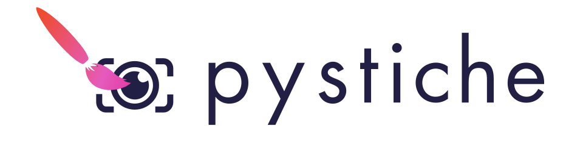

Welcome to ``pystiche`` 's documentation!
=========================================

``pystiche`` (pronounced
`/ˈpaɪˈstiʃ/ <http://ipa-reader.xyz/?text=%CB%88pa%C9%AA%CB%88sti%CA%83>`_ ) is a
framework for
`Neural Style Transfer (NST) <https://github.com/ycjing/Neural-Style-Transfer-Papers>`_
built upon `PyTorch <https://pytorch.org>`_. The name of the project is a pun on
*pastiche* `meaning <https://en.wikipedia.org/wiki/Pastiche>`_:

    A pastiche is a work of visual art [...] that imitates the style or character of
    the work of one or more other artists. Unlike parody, pastiche celebrates, rather
    than mocks, the work it imitates.

``pystiche`` has similar goals as Deep Learning (DL) frameworks such as PyTorch:

1. **Accessibility**
    Starting off with NST can be quite overwhelming due to the sheer amount of
    techniques one has to know and be able to deploy. ``pystiche`` aims to provide an
    easy-to-use interface that reduces the necessary prior knowledge about NST and DL
    to a minimum.
2. **Reproducibility**
    Implementing NST from scratch is not only inconvenient but also error-prone.
    ``pystiche`` aims to provide reusable tools that let developers focus on their
    ideas rather than worrying about bugs in everything around it.

.. toctree::
  :maxdepth: 1
  :caption: Contents

  Getting Started <getting_started/index>
  Gist <gist/index>
  Usage Examples <galleries/examples/index>
  Package Reference <api/index>
  Literature Reference <literature>
