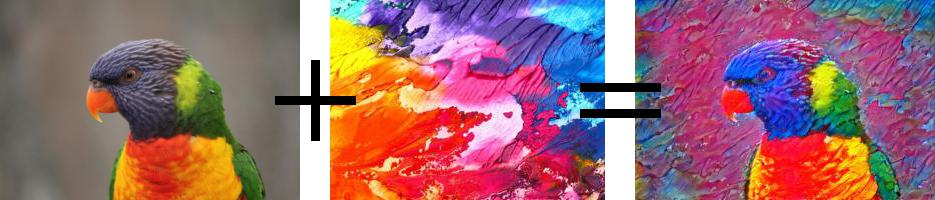

# Summary

The seminal work of Gatys, Ecker, and Bethge gave birth to the field of 
_Neural Style Transfer_ (NST) in 2016 [@GEB2016]. The general idea behind an NST can be 
conveyed with only three images and two symbols:

In words: an NST describes the merger between the content and artistic style of two 
arbitrary images. This idea is nothing new in the field of 
_Non-photorealistic rendering_ (NPR) [@GG2001]. What distinguishes NST from traditional 
NPR approaches is its generality: an NST only needs a single arbitrary content and 
style image as input and thus "makes -- for the first time -- a generalized style 
transfer practicable" [@SID2017].

Besides peripheral tasks, an NST at its core is the definition of an optimization 
criterion called _perceptual loss_, which estimates the perceptual quality of the 
stylized image. Usually the perceptual loss comprises a deep neural network that needs 
to supply encodings of images from various depths.

`pystiche` is a framework for NST written in Python and built upon the _Deep Learning_ 
(DL) framework PyTorch [@PGM+2019]. It provides modular and efficient implementations 
for commonly used perceptual losses [@MV2015; @GEB2016; @LW2016] as well as neural net 
architectures [@SZ2014; @KSH2012]. This enables users to mix current state-of-the-art 
techniques with new ideas with ease. 

Due to its vivid nature, the field of NST gained a lot of traction in the short time 
after its emergence [@JYF+2019]. While many new techniques or augmentations have been 
developed, the field lacks standardization, which is especially evident in the 
reference implementations of the authors. `pystiche` aims to fill this gap.

# Statement of Need

Currently, unlike DL, there exist no library or framework for implementing NST. Thus, 
authors of new NST techniques either implement everything from scratch or base their 
implementation upon existing ones of other authors. Both ways have their downsides: 
while the former dampens innovation due to the lengthy implementation of reusable 
parts, with the latter the author inherits the technical debt due to the rapid 
development pace of DL hard- and software. In order to overcome this, `pystiche` 
pursues similar goals as DL frameworks:

1. **Accessibility**
   Starting off with NST can be quite overwhelming due to the sheer amount of 
   techniques one has to know and be able to deploy. `pystiche` aims to provide an 
   easy-to-use interface that reduces the necessary prior knowledge about NST and DL 
   to a minimum.
2. **Reproducibility**
   Implementing NST from scratch is not only inconvenient but also error-prone. 
   `pystiche` aims to provide reusable tools that let developers focus on their ideas 
   rather than worrying about everything around it.

`pystiche`s core audience are researchers, but its easy-to-use user interface 
opens up the field of NST for recreational use by laypersons.

# Acknowledgements

This contribution is part of the project _Fused Security Features_, which is funded by 
the _Ministry for Culture and Science of North Rhine-Westphalia_ (MKW NRW) under the 
Grant ID `005-1703-0013`. The authors thank Julian Bültemeier for extensive internal 
testing.

# References
